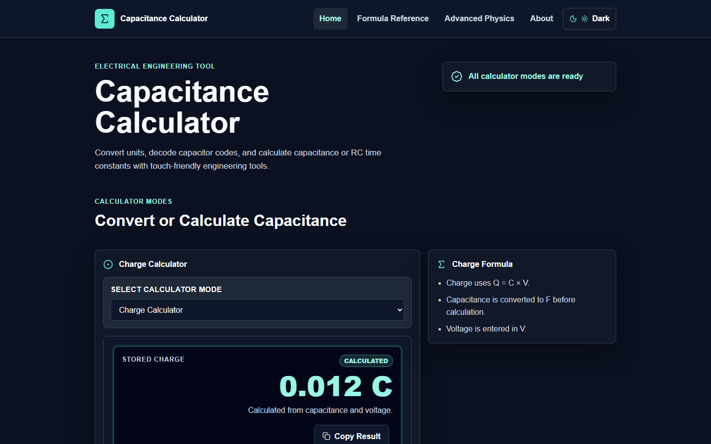
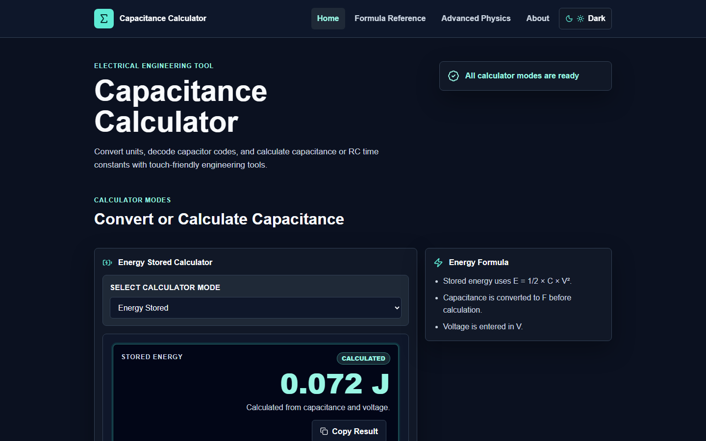

# Capacitance Calculator


A responsive, browser-based capacitance calculator suite for electronics students, hobbyists, makers, and beginners learning capacitor math. Built with plain PHP, HTML, CSS, and vanilla JavaScript, the project combines practical calculator modes with a beginner-friendly Formula Reference page, local calculation history, export tools, copyable results, and a mobile-first interface.

## Project Status

**Current version:** `v1.0.0`

This project is a working educational/reference calculator suite. It runs locally with XAMPP and stores calculator history in the browser using `localStorage`. It does not use PHP sessions, MySQL, Composer, or a backend database yet.

## Live Demo

🌐 Live Demo
https://capacitance-calculator-demo.vercel.app/

This repository contains the original PHP/XAMPP development version.

A static demo version is deployed on Vercel for public access using the link above.

For now, run the project locally with XAMPP:

```text
http://localhost/Project2-calculator/
```

## Target Audience

- Electronics students learning capacitance formulas
- Hobbyists and makers working with capacitor values
- Beginners decoding capacitor markings
- Developers reviewing a plain PHP and vanilla JavaScript portfolio project
- Instructors looking for a simple educational calculator reference

## Feature Highlights

- **Seven calculator modes** in one clean interface
- **Mobile-friendly calculator controls** with a dedicated Unit Converter keypad and shared numeric keypad
- **Formula breakdowns and technical details** for supported calculator modes
- **Recent Calculations history** stored locally per calculator mode
- **Clickable history restore** for saved calculations with restore data
- **TXT and CSV export** for per-mode history
- **Copy Result buttons** for sharing a short input summary and final result
- **Dark/light theme toggle** with saved browser preference
- **Formula Reference page** written for electronics beginners
- **Responsive design** for phones, tablets, and desktop screens
- **Playwright screenshot automation** for GitHub-ready project images

## Calculator Modes

| Mode | What It Does |
| --- | --- |
| **Unit Converter** | Converts capacitance between `pF`, `nF`, `µF`, and `F`. |
| **Series Capacitance** | Calculates total capacitance for capacitors connected end-to-end using `1/Ct = 1/C1 + 1/C2 + ...`. |
| **Parallel Capacitance** | Calculates total capacitance for capacitors connected across the same two nodes using `Ct = C1 + C2 + ...`. |
| **Capacitor Code Decoder** | Decodes standard 3-digit capacitor codes such as `104`, `103`, `472`, and `223`. |
| **RC Time Constant** | Calculates `τ = R × C` using resistance and capacitance values. |
| **Charge Calculator** | Calculates stored charge with `Q = C × V` and shows results in `C`, `mC`, `µC`, and `nC`. |
| **Energy Stored** | Calculates capacitor energy with `E = 1/2 × C × V²` and shows results in `J`, `mJ`, and `µJ`. |

## Screenshots

### Home Page


### Unit Converter


### Charge Calculator


### Energy Stored


### Formula Reference


## Technologies Used

- **PHP** for shared page includes and plain XAMPP routing
- **HTML5** for semantic page structure
- **CSS3** with custom properties for responsive design and dark/light themes
- **Vanilla JavaScript** for calculator behavior and browser storage
- **Lucide Icons** via CDN
- **localStorage** for local history and theme preference
- **XAMPP / Apache** for local PHP development
- **Playwright** for browser checks and screenshot automation

## How to Run Locally With XAMPP

1. Install and open XAMPP.
2. Start **Apache**.
3. Place this project folder here:

   ```text
   C:\xampp\htdocs\Project2-calculator
   ```

4. Open the app in your browser:

   ```text
   http://localhost/Project2-calculator/
   ```

5. Open the Formula Reference page directly:

   ```text
   http://localhost/Project2-calculator/pages/formula-reference.php
   ```

## How to Use the Calculator

1. Open the app in your browser.
2. Use the in-card mode selector to choose a calculator mode.
3. Enter values using your keyboard, the Unit Converter keypad, or the shared numeric keypad.
4. Select the correct units.
5. Press the visible calculate button or the shared `=` key.
6. Read the primary result display first.
7. Review formula breakdowns and technical details when available.
8. Use Copy Result, Recent Calculations, Restore, Export TXT, or Export CSV as needed.

## Formula Reference Page

The Formula Reference page explains each calculator mode in beginner-friendly language. Each section includes:

- Formula
- Simple explanation
- Example calculation
- When to use it

Covered topics:

- Unit Conversion
- Series Capacitance
- Parallel Capacitance
- Capacitor Code Decoder
- RC Time Constant
- Charge Calculator
- Energy Stored

Use the **Formula Reference** link in the header navigation or open:

```text
http://localhost/Project2-calculator/pages/formula-reference.php
```

## Local History, Restore, Export, and Copy

Recent calculations are stored locally in the browser for each calculator mode. The app keeps the latest five entries per mode.

- **Restore**: Refill previous inputs without auto-calculating.
- **Export TXT**: Download readable history entries for the current mode.
- **Export CSV**: Download spreadsheet-friendly history entries for the current mode.
- **Clear History**: Clear only the active mode's saved entries.
- **Copy Result**: Copy the mode name, short input summary, and final result after a valid calculation.

Because history uses `localStorage`, saved entries stay on the same browser and device only.

## Mobile Support

The interface is designed mobile-first:

- Controls use touch-friendly sizing.
- Calculator cards stack cleanly on small screens.
- Shared keypads reduce reliance on the phone keyboard.
- History, export, and copy controls wrap to avoid horizontal scrolling.
- Result cards prioritize the main answer and keep secondary values readable.

## Dark/Light Theme

The app defaults to dark theme and includes a header theme toggle. The selected theme is saved in `localStorage`, so it persists after reload.

## Screenshot Automation

Playwright can capture project screenshots for the README.

```bash
npm install
npm run screenshots
```

The script saves images to:

```text
docs/screenshots/
```

It expects the local site to be available at:

```text
http://localhost/Project2-calculator/
```

## Folder Structure

```text
Project2-calculator/
├── index.php
├── README.md
├── package.json
├── playwright.config.js
│
├── assets/
│   ├── css/
│   │   ├── style.css
│   │   ├── calculator.css
│   │   └── responsive.css
│   └── js/
│       ├── main.js
│       ├── capacitance-calculator.js
│       ├── capacitor-code-decoder.js
│       ├── charge-calculator.js
│       ├── copy-result.js
│       ├── energy-calculator.js
│       ├── history.js
│       ├── mobile-nav.js
│       ├── rc-time-calculator.js
│       ├── shared-keypad.js
│       ├── theme-toggle.js
│       └── unit-converter.js
│
├── docs/
│   └── screenshots/
│       ├── home.png
│       ├── unit-converter.png
│       ├── charge-calculator.png
│       ├── energy-stored.png
│       └── formula-reference.png
│
├── includes/
│   ├── header.php
│   └── footer.php
│
├── pages/
│   ├── about.php
│   └── formula-reference.php
│
├── scripts/
│   └── capture-screenshots.js
│
└── tests/
    └── example.spec.js
```

## Version

### v1.0.0

Initial complete calculator suite with:

- Seven calculator modes
- Formula Reference page
- About page
- Dark/light theme
- Local calculation history
- History restore
- TXT/CSV history export
- Copy Result buttons
- Shared numeric keypad
- Screenshot automation

## Roadmap

- PWA support with offline caching and install prompt
- More automated tests for calculator edge cases
- Better saved-history management
- Optional user-selectable result units for Series and Parallel modes
- Capacitive reactance calculator
- Tolerance support for capacitor code decoding
- Printable Formula Reference page
- Optional deployment for a public live demo

## Contributing

Contributions are welcome for bug fixes, documentation improvements, accessibility refinements, and additional calculator modes.

Suggested workflow:

1. Fork the project.
2. Create a focused feature or fix branch.
3. Keep calculator formulas and validation rules easy to review.
4. Test changes locally with XAMPP.
5. Submit a pull request with a clear summary and screenshots when UI changes are involved.

## Educational Use Notice

This calculator is intended for learning, prototyping, and reference. For critical engineering, manufacturing, safety, or high-voltage work, verify results with trusted engineering tools and component datasheets.

## License

This project is released under the **ISC License**.

## Keywords

`capacitance calculator`, `capacitor calculator`, `electronics calculator`, `series capacitance`, `parallel capacitance`, `capacitor code decoder`, `RC time constant`, `charge calculator`, `energy stored capacitor`, `PHP project`, `XAMPP project`, `vanilla JavaScript`
